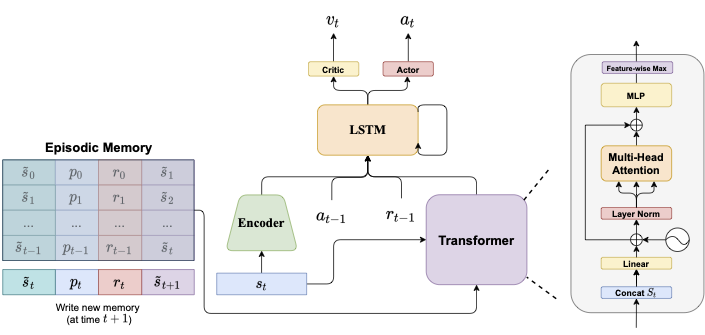

# How to Learn and Represent Abstractions: An Investigation using Symbolic Alchemy

[Paper](https://arxiv.org/abs/2112.08360) | [Visualization Tool](https://github.com/BKHMSI/symbolic_alchemy_visualizer)

This repository contains the code to train and evaluate the **A2C EPN** agent on the Symbolic Alchemy environment as detailed in our [paper](https://arxiv.org/abs/2112.08360). We also release a visualization tool to debug the agent's behavior [here](https://github.com/BKHMSI/symbolic_alchemy_visualizer).

## A2C EPN

<div style="text-align:center">
    
</div>

## Setup

You will first need to download and install the [DeepMind Alchemy Environment](https://github.com/deepmind/dm_alchemy) as follows:

```bash
$ git clone https://github.com/deepmind/dm_alchemy.git
$ pip install wheel
$ pip install --upgrade setuptools
$ pip install ./dm_alchemy
```

Then install the remaining requirements

```bash
pip install -r requirements.txt
```

## Pretrained Models

- [Best A2C EPN agent](https://drive.google.com/file/d/10lOUNjVGMtYyHo258PPMMbhz74yHgIS-/view?usp=sharing) achieves an average episode score of 272.85 ± 1.78 with the modified representations.

- [A2C EPN agent](https://drive.google.com/file/d/1TLbgEzFcBT7t-B4hM6wus5PC1Eaz36Np/view?usp=sharing) trained without extra reward shaping (i.e. penalties) achieves a score of 236.06 ± 2.18. 

## Abstract 

Alchemy is a new meta-learning environment rich enough to contain interesting abstractions, yet simple enough to make fine-grained analysis tractable. Further, Alchemy provides an optional symbolic interface that enables meta-RL research without a large compute budget. In this work, we take the first steps toward using Symbolic Alchemy to identify design choices that enable deep-RL agents to learn various types of abstraction. Then, using a variety of behavioral and introspective analyses we investigate how our trained agents use and represent abstract task variables, and find intriguing connections to the neuroscience of abstraction. We conclude by discussing the next steps for using meta-RL and Alchemy to better understand the representation of abstract variables in the brain.


## Citation

```
@misc{alkhamissi2021_symbolic_alchemy,
      title={How to Learn and Represent Abstractions: An Investigation using Symbolic Alchemy}, 
      author={Badr AlKhamissi and Akshay Srinivasan and Zeb-Kurth Nelson and Sam Ritter},
      year={2021},
      eprint={2112.08360},
      archivePrefix={arXiv},
      primaryClass={cs.LG}
}
```

